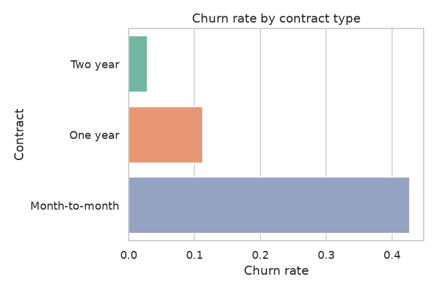
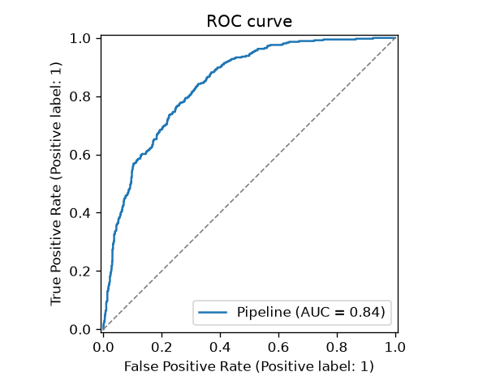
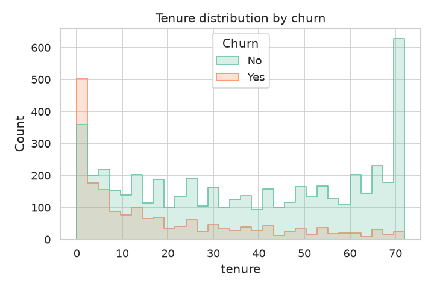
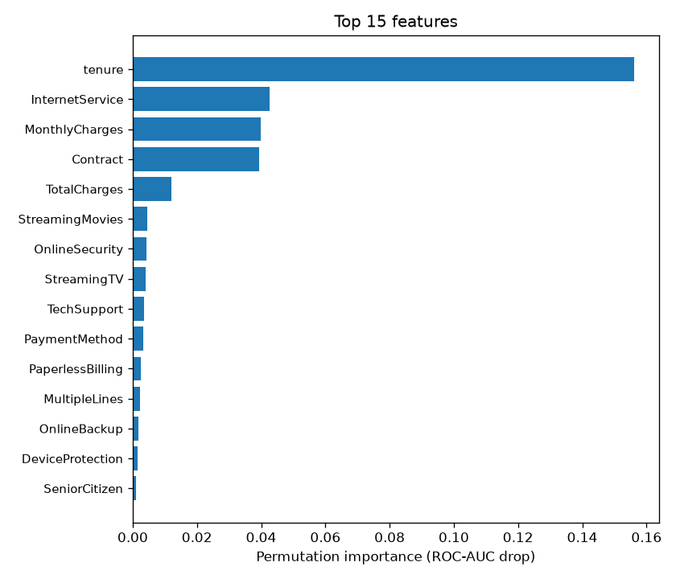

# Customer Churn Prediction


[](https://www.kaggle.com/code/delcenjo/telco-customer-churn-ml)

End-to-end machine learning pipeline that predicts which telecom customers are
likely to churn, so retention efforts can be focused where they matter most.

> **Interactive version:** the same EDA and model comparison is available as a
> runnable [Kaggle notebook](https://www.kaggle.com/code/delcenjo/telco-customer-churn-ml).

The project covers the full workflow: data cleaning, exploratory analysis,
a reusable preprocessing pipeline, model comparison with cross-validation, and
evaluation on a held-out test set.

## Problem

Customer acquisition is far more expensive than retention. Given a customer's
contract, services and billing profile, the goal is to estimate the probability
of churn and identify the factors that drive it. The target is imbalanced
(~26% churn), so models are compared with **ROC-AUC** rather than accuracy.

## Dataset

Telco Customer Churn - 7,043 customers and 21 columns (demographics, subscribed
services, contract and billing). The raw file is not versioned; download it with
`python scripts/download_data.py` (see [data/README.md](data/README.md)).

## Approach

1. **Cleaning** - drop the identifier, coerce `TotalCharges` to numeric (blank for
   new customers), encode the target.
2. **Preprocessing** - a `ColumnTransformer` scales numeric features and
   one-hot-encodes categoricals, wrapped in a `Pipeline` to prevent data leakage.
3. **Modelling** - logistic regression (baseline), random forest and gradient
   boosting, compared with 5-fold cross-validated ROC-AUC.
4. **Evaluation** - the best model is refit and scored on the test set; figures
   for the ROC curve, confusion matrix and permutation importance are generated.

## Project structure

```
src/churn/
  config.py      paths and constants
  data.py        loading and cleaning
  features.py    preprocessing pipeline
  eda.py         exploratory figures
  train.py       model comparison, training, persistence
  evaluate.py    evaluation figures
tests/           unit tests for data and features
scripts/         dataset download
reports/         metrics and figures
```

## Usage

```bash
python -m venv .venv && source .venv/bin/activate
pip install -e ".[dev]"

python scripts/download_data.py     # fetch the dataset
python -m churn.eda                 # exploratory figures
python -m churn.train               # compare models, train and persist the best
python -m churn.evaluate            # evaluation figures
pytest                              # run the tests
```

## Results

Five-fold cross-validated ROC-AUC on the training set:

| Model               | CV ROC-AUC      |
| ------------------- | --------------- |
| Logistic regression | 0.845 ± 0.014   |
| Gradient boosting   | 0.833 ± 0.011   |
| Random forest       | 0.825 ± 0.013   |

The logistic regression generalises best and is retrained on the full training
split. On the held-out test set (1,409 customers):

| Metric    | Score |
| --------- | ----- |
| ROC-AUC   | 0.842 |
| Accuracy  | 0.738 |
| Precision | 0.504 |
| Recall    | 0.783 |
| F1        | 0.614 |

With balanced class weights the model is tuned towards **recall**: it flags ~78%
of customers who actually churn, accepting lower precision. That trade-off is the
right one when a missed churner costs far more than an unnecessary retention offer.

| Exploratory analysis | Model evaluation |
| --- | --- |
|  |  |
|  |  |

**Key drivers of churn:** month-to-month contracts, short tenure and high monthly
charges. Customers on long contracts churn far less, which points to contract
length as the most actionable retention lever. Full metrics in
[reports/metrics.json](reports/metrics.json).

## Possible improvements

- Threshold tuning driven by the business cost of false negatives.
- Probability calibration and SHAP-based explanations.
- Packaging the model behind a small inference API.
